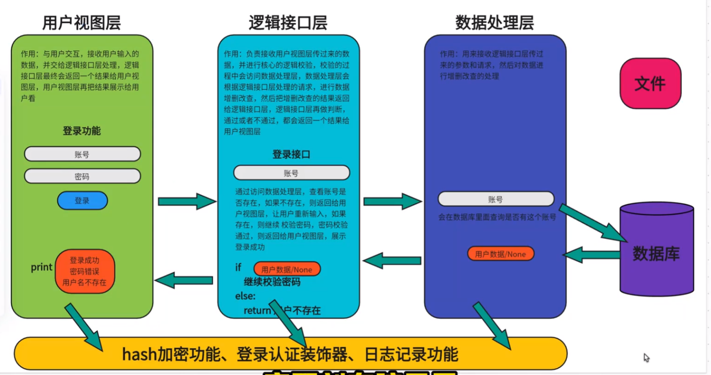

## 需求
1. 支持多账户登录  -->登录功能
2. 初始账户余额为0  -->账户功能(注册)
3. 提供充值接口，充值后才能消费  -->充值功能
4. 实现购物功能，可加入购物车，使用账户余额结账  -->购物功能
   - 购物车功能
   - 结账功能
   - 商品列表
   - 商品详情
   - 商品分类
   - 商品搜索
5. 实现提现功能，手续费10% -->提现功能
   - 提现申请
   - 提现审核
   - 提现记录
   - 提现状态查询
6. 实现账户间转账  -->转账功能
   - 转账申请
   - 转账审核
   - 转账记录
   - 转账状态查询
7. 记录日常消费流水 -->消费流水功能
   - 消费记录
   - 消费统计
   - 消费查询
   - 消费分析
8. 记录用户操作日志 -->操作日志功能
   - 日志记录
   - 日志查询
   - 日志分析
9. 提供管理接口，包括添加账户、冻结账户、给用户充值等 -->管理功能
   - 账户管理
   - 冻结账户
   - 充值账户
   - 用户查询
   - 用户统计
   - 用户分析
10. 用户认证用装饰器 -->认证功能
    - 登录认证
    - 权限认证
    - 角色认证

用户视图层展示的功能：
0.退出
1、注册功能
2.登录功能
3.充值功能
4、转账功能
5、提现功能
6、查看余额
7、查看流水
8、购物功能
9、查看商品列表
10、退出账号
11、管理员功能

## 项目的全流程
* 项目发起人、项目经理、前端、后端、需求分析师，跟客户做需求调研，判断项目的功能能否实现，项目短周期、价格·**->需求文档**
* 技术总监、产品经理、项目经理等，开会讨论项目具体的实现方法，采用什么架构等等**->开发文档**

## 岗位
* UI设计:设计软件的布局，按钮的颜色等等
* 前端:根据UI设计的界面，做界面搭建(网页界面、pc软件界面、app界面)
* 后端:写核心的业务逻辑，调度数据库进行数据的增删改查
* 测试:功能测试、压力测试、界面测试、安全测试等等
* 运维:上线部署

## 项目架构图

最后就是:开发->测试->上线->运维

## 